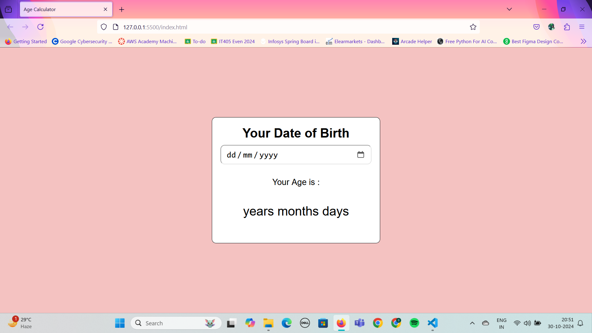
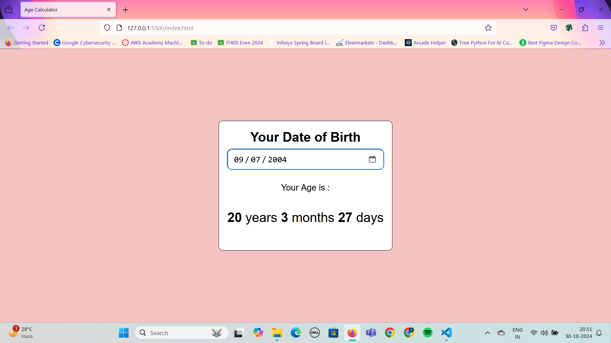

Age Calculator Website

This project is a simple Age Calculator website that calculates a user's age based on their birthdate input. Built with HTML, CSS, and JavaScript, the app provides users with an easy way to find out their exact age in years, months, and days.
Table of Contents

    Features
    Technologies
    Usage
    Future Improvements
    Acknowledgements

Features

    Calculate exact age (years, months, days) based on the user's birthdate.
    User-friendly interface with clear input and output fields.
    Error handling for invalid inputs (e.g., future dates).

Technologies

    HTML5 - for structuring the content
    CSS3 - for styling the page
    JavaScript - for calculations and interactivity

Usage

    Enter your birthdate in the input field provided.
    Click the "Calculate" button.
    The website will display your age in years, months, and days.

Future Improvements

    Responsive Design: Adapt layout for different screen sizes.
    Additional Age Formats: Calculate age in weeks, hours, or minutes.
    Theme Options: Add dark and light mode options.

Acknowledgements

This project was inspired by the need for a quick and accurate way to calculate age and understand exact time since birth. Thanks to various online tutorials and documentation for guidance.

Here are some screenshots of the Age_Calculator Website:

