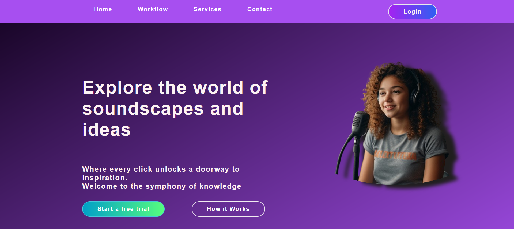
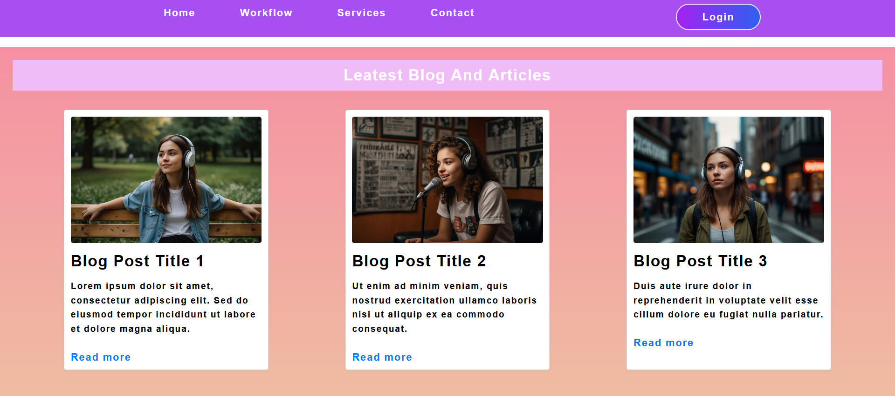
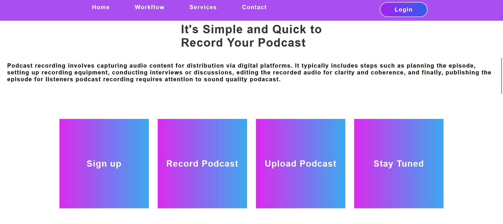

Podcasting Website (Frontend)
Project Description

This is a podcasting website frontend where users can explore various podcasts, listen to their favorite episodes, and stay updated with the latest content from different creators. The website features an intuitive and responsive design, ensuring a seamless experience across devices. In addition to podcasts, the website also includes a section for reading blogs and articles on various topics, enhancing the overall user experience.
Features

    Browse podcasts by categories or creators.
    Play, pause, and navigate between podcast episodes.
    Read blogs and articles on a variety of subjects.
    Mobile-responsive design for optimal user experience across devices.
    Modern UI/UX with interactive elements.

Tech Stack

    HTML5: Structure the web pages.
    CSS3: Style the website for responsive layouts and visually appealing design.
    JavaScript: Add interactivity, dynamic elements, and user interaction.
    React (optional): For building a more dynamic and component-based structure.
    Bootstrap (optional): For quick, responsive design and layout.

Installation & Usage
Prerequisites

To view this project, all you need is a web browser. If you're running this locally, a code editor like VS Code and a basic understanding of HTML/CSS/JavaScript will be useful.
Installation

    Download or clone the project repository from GitHub.
    Open the project folder.
    You can directly open the index.html file in your browser to view the frontend.

Usage

    Open the index.html file in any web browser.
    Navigate through the website to explore the podcast section and the blogs and articles section.
    No backend or server setup is required as this is a frontend-only project.

Blogs and Articles

This website also features a dedicated section for blogs and articles, where users can read content on various topics such as technology, entertainment, education, and more. It enriches the user experience beyond just podcasts.

