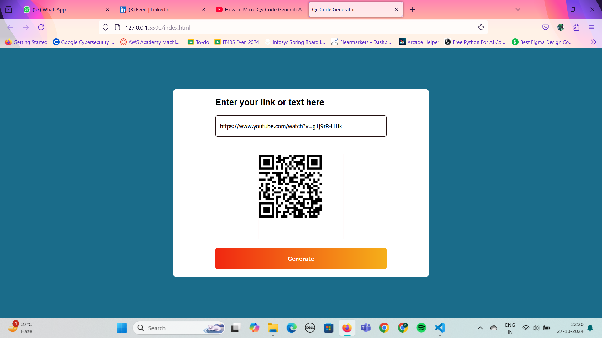

QR Code Generator Website

A responsive QR Code Generator website built with HTML, CSS, and JavaScript, allowing users to easily create custom QR codes for various types of data. This website is designed to be simple and user-friendly, providing a quick and efficient way to generate QR codes that can be used for business, personal, or educational purposes.
Table of Contents

    Features
    Technologies Used
    Setup and Installation
    Usage
    Contributing
    License

Features

    Customizable QR Code Generation: Allows users to generate QR codes by entering text, URLs, or other data.
    Responsive Design: Works seamlessly on different devices, including desktops, tablets, and mobile phones.
    Downloadable QR Codes: Generated QR codes can be downloaded as images for easy sharing and use.
    Real-Time Updates: Instant QR code generation as the user types data.
    Clean and Intuitive UI: A simple interface for an easy-to-use experience.

Technologies Used

    HTML - Structuring the content on the webpage.
    CSS - Styling for a visually appealing and responsive layout.
    JavaScript - Implementing the QR code generation functionality and interactivity.

Setup and Installation

    Clone the Repository

    bash

    git clone https://github.com/your-username/qr-code-generator-website.git
    cd qr-code-generator-website

    Open the project
        Open index.html in your preferred browser to view the website.

No additional installations are required as this project is built using only HTML, CSS, and JavaScript.
Usage

    Input Data: Enter the text, URL, or data that you want to convert to a QR code.
    Generate QR Code: Click on the "Generate" button to instantly create the QR code.
    Download QR Code: Click on the "Download" button to save the generated QR code as an image.

This QR Code Generator can be used for:

    Creating QR codes for business cards.
    Generating QR codes for website links, Wi-Fi credentials, or any text data.
    Easy sharing of QR codes on social media or printing them for physical use.

Contributing

Contributions are welcome! If you'd like to contribute, please fork the repository and create a new branch for any changes. Submit a pull request when ready.

    Fork the project.
    Create your feature branch (git checkout -b feature/YourFeature).
    Commit your changes (git commit -m 'Add your feature').
    Push to the branch (git push origin feature/YourFeature).
    Open a pull request.

Here are some screenshots of the Qrcode Generator Website:

