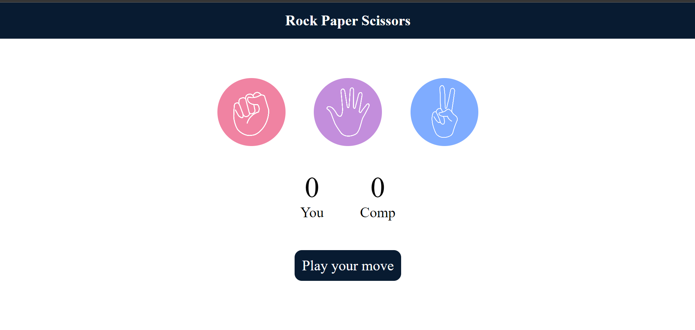

# Rock, Paper, Scissors Game

## Description

This is a simple implementation of the classic Rock, Paper, Scissors game using HTML, CSS, and JavaScript. The user selects either "Rock", "Paper", or "Scissors", and the computer randomly selects an option. The game then determines the winner and displays the result.

## Features

- User can select Rock, Paper, or Scissors.
- The computer randomly selects an option.
- Displays the winner (User or Computer) or a draw.

## Technologies

- HTML
- CSS
- JavaScript

## How to Play

1. Choose either **Rock**, **Paper**, or **Scissors** by clicking on the corresponding button.
2. The computer will randomly make its choice.
3. The result will be displayed, indicating whether you won, lost, or it was a draw.

## Installation

1. Clone this repository:
   ```bash
   git clone https://github.com/yourusername/rock-paper-scissors.git

## Screenshot


