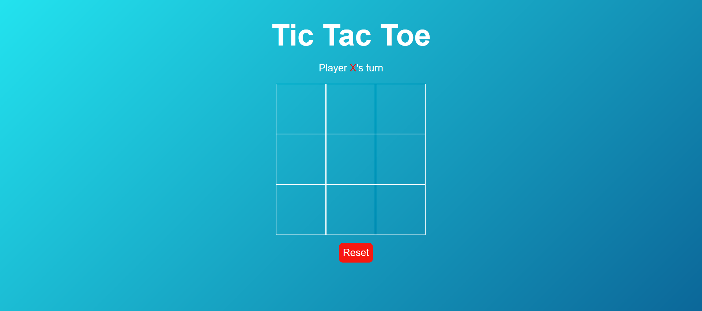
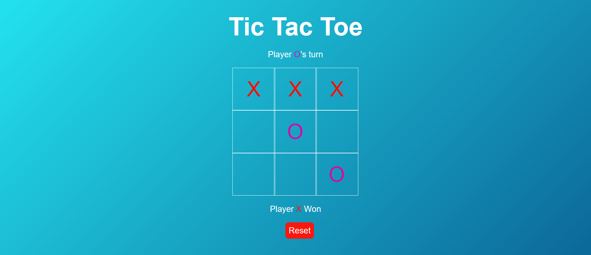
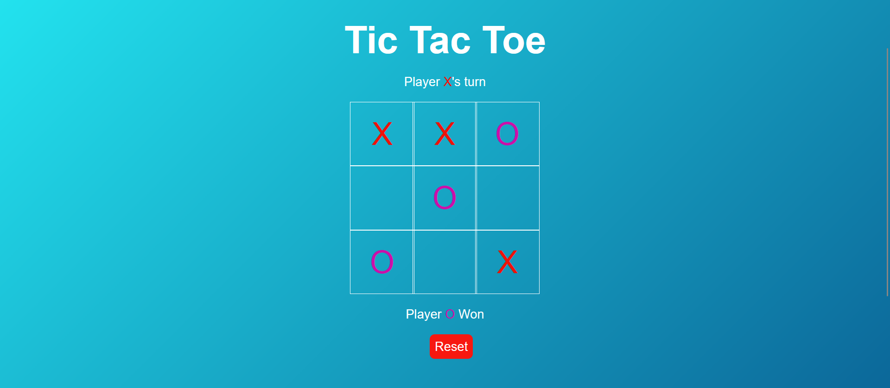
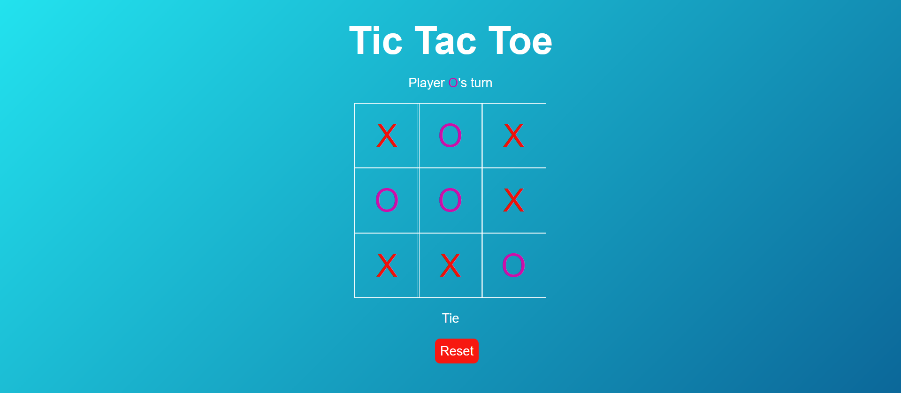

Tic Tac Toe Game

A simple yet fun Tic Tac Toe game built using HTML, CSS, and JavaScript. This game allows two players to play Tic Tac Toe on a 3x3 grid, with alternating turns, and provides instant feedback on game outcomes (win, draw).
Table of Contents

    Features
    Technologies
    How to Play
    Installation
    Contributing
    Screenshots

Features

    Player vs Player: Two players can play against each other.
    Responsive Design: Adapts to different screen sizes.
    Win Detection: The game automatically detects when a player wins.
    Draw Detection: If all spots are filled and no one wins, the game declares a draw.
    Reset Option: Players can reset the game at any time and start fresh.

Technologies

    HTML5: For the game structure and layout.
    CSS3: For styling and designing a responsive UI.
    JavaScript: For game logic and interactivity.

How to Play

    The game starts with Player 1 (X) making the first move.
    Players take turns by clicking on the available spaces in the grid.
    The game checks for a win or draw after every move.
    A player wins by placing three of their marks in a horizontal, vertical, or diagonal row.
    If all spaces are filled and there is no winner, the game results in a draw.
    Click the reset button to start a new game.

Installation

   To view this project, all you need is a web browser. If you're running this locally, a code editor like VS Code and a basic understanding of HTML/CSS/JavaScript will be useful.

    Download or clone the project repository from GitHub.
    Open the project folder.
    You can directly open the index.html file in your browser to view the project.

Contributing

If you wish to contribute, feel free to fork the repository and submit a pull request.

    Fork it.
    Create your feature branch (git checkout -b feature/AmazingFeature).
    Commit your changes (git commit -m 'Add some AmazingFeature').
    Push to the branch (git push origin feature/AmazingFeature).
    Open a pull request.

Screenshots

Here are some screenshots of the Tic Tac Toe game:

